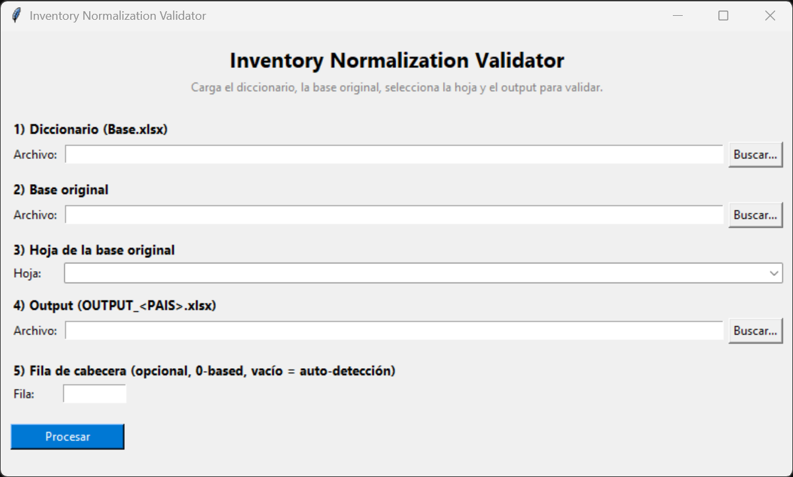

## 🔍 DEEP CODE ANALYSIS

### 1. Repository Classification
This project is classified as an **Application/Data Processing Tool with Web UI**. It serves as a specialized utility for data validation and reporting, integrated with a simple web interface for user interaction and file uploads.

### 2. Technology Stack Detection

**Runtime:**
- **Python**: Core language for all primary scripts (`app.py`, `ui_app.py`, and modules within `transform_validator/`).

**Backend/Web Framework:**
- **Flask**: Highly likely used in `ui_app.py` to provide the "simple UI for file upload" and serve the web interface, given the common patterns for Python web applications of this nature.

**Data Processing & Reporting:**
- **Pandas**: Virtually certain to be used for reading, manipulating, and comparing tabular data (master mapping, original data, output files).
- **Openpyxl / XlsxWriter**: Inferred for generating sophisticated Excel reports, especially those with "detailed errors and heatmaps."

### 3. Project Structure Analysis

The repository exhibits a clear, albeit minimal, structure:
- **Entry Points:**
    - `ui_app.py`: The main entry point for running the web application and interacting with the UI.
    - `app.py`: Likely contains the core data validation and transformation logic, which `ui_app.py` would call.
- **Source Code Organization:**
    - `transform_validator/`: A directory indicating a modular organization for the core validation and transformation algorithms, encapsulating complex logic separate from the main application files.
- **Configuration Files:** None explicitly detected (e.g., `requirements.txt`, `.env.example`, `config.py`).
- **Test Directories:** No dedicated `tests/` directory detected.

```
project-root/
├── app.py                      # Core validation and transformation logic
├── ui_app.py                   # Web UI entry point (Flask application)
├── transform_validator/        # Directory for modular validation components
└── README.md                   # Project documentation
```

### 4. Feature Extraction

Based on the code structure and description, the core functionalities are:
-   **Web-based File Upload:** Provides a user interface (`ui_app.py`) for uploading input files (master mapping, original data, country-specific output files).
-   **Inventory Data Normalization Validation:** Reads and processes inventory data to validate its normalization structure across different countries.
-   **Configurable Data Comparison:** Compares specific parameters, models, and overall totals between transformed data and expected outputs.
-   **Automated Transformation Recomputation:** Recomputes the data transformation based on the master mapping to verify accuracy.
-   **Detailed Excel Report Generation:** Produces comprehensive Excel reports (`.xlsx`) that highlight:
    -   Specific errors found during validation.
    -   Discrepancies in parameters, models, and totals.
    -   Visual "heatmaps" to easily identify validation issues.
-   **Modular Validation Logic:** The `transform_validator/` directory suggests a well-organized and potentially extensible architecture for different validation routines.

### 5. Installation & Setup Detection

-   **Package Manager:** `pip` (standard for Python).
-   **Installation Commands:** Requires `pip install` for identified dependencies.
-   **Build Processes:** No complex build process detected; runs directly with Python.
-   **Development Server Setup:** Executing `ui_app.py` directly will start the web server (e.g., `flask run` or `python ui_app.py`).
-   **Environment Requirements:** Python 3.x.
-   **Database Setup Needs:** No persistent database setup is required; the tool processes data from uploaded files.
-   **External Service Dependencies:** None detected.

---

# 🚀 DataBaseValidator

<div align="center">

[](https://github.com/alejob774/DataBaseValidator/stargazers)
[](https://github.com/alejob774/DataBaseValidator/network)
[](https://github.com/alejob774/DataBaseValidator/issues)
[](LICENSE) <!-- TODO: Add actual license file or name -->

**A Python-based tool for comprehensive inventory database normalization validation and reporting with an intuitive web UI.**

[Live Demo](https://demo-link.com) <!-- TODO: Add live demo link if available --> |
[Documentation](https://docs-link.com) <!-- TODO: Add external documentation link if available -->

</div>

## 📖 Overview

The `DataBaseValidator` is a powerful Python application designed to streamline the process of validating inventory database normalization across multiple countries. It provides a robust framework to compare transformed inventory data against a master mapping and original datasets, ensuring data integrity and consistency. With its user-friendly web interface, users can easily upload files, trigger validation processes, and receive detailed Excel reports featuring errors, discrepancies, and visual heatmaps. This tool is invaluable for data analysts, inventory managers, and QA teams requiring precise data verification and reporting.

## ✨ Features

-   **Web-based File Upload Interface**: Simple and intuitive UI for uploading master mapping dictionaries, original inventory data, and country-specific output files.
-   **Multi-Country Data Validation**: Systematically validates inventory data normalization standards across different geographical regions.
-   **Transformation Recomputation & Comparison**: Automatically recomputes data transformations and compares key parameters, models, and totals to detect discrepancies.
-   **Detailed Excel Reports**: Generates comprehensive `.xlsx` reports with granular error descriptions and easy-to-interpret heatmaps for quick issue identification.
-   **Modular Validation Logic**: Structured `transform_validator` module allows for maintainable and potentially extensible validation routines.
-   **Python-Powered Efficiency**: Leverages Python's data processing capabilities for efficient and accurate validation.

## 🖥️ Screenshots

<!-- TODO: Add actual screenshots of the web UI and generated reports -->
<!--  -->
<!--  -->

## 🛠️ Tech Stack

**Runtime:**
-   

**Web Framework:**
-   

**Data Processing & Reporting:**
-   
-    <!-- Assumed for Excel generation -->

## 🚀 Quick Start

Follow these steps to get `DataBaseValidator` up and running on your local machine.

### Prerequisites
-   **Python 3.8+**: It is recommended to use a recent version of Python.

### Installation

1.  **Clone the repository**
    ```bash
    git clone https://github.com/alejob774/DataBaseValidator.git
    cd DataBaseValidator
    ```

2.  **Create a virtual environment** (recommended)
    ```bash
    python -m venv venv
    source venv/bin/activate  # On macOS/Linux
    # venv\Scripts\activate   # On Windows
    ```

3.  **Install dependencies**
    ```bash
    pip install Flask pandas openpyxl
    ```
    *Note: A `requirements.txt` file is not provided. The listed packages are inferred from the project's description and common Python practices for this type of application.*

4.  **Start development server**
    ```bash
    python ui_app.py
    ```

5.  **Open your browser**
    Visit `http://localhost:5000` (default Flask port)

## 📁 Project Structure

```
DataBaseValidator/
├── app.py                      # Contains the core validation and transformation algorithms.
├── ui_app.py                   # The main Flask application entry point for the web interface.
├── transform_validator/        # Directory housing modular Python scripts for data transformation and specific validation routines.
│   └── __init__.py             # Makes the directory a Python package.
└── README.md                   # This README file.
```

## 🔧 Development

### Running the Application
The primary way to run the application is by executing `ui_app.py` as described in the Quick Start. This will launch the Flask development server.

### Core Logic
The `app.py` module contains the central logic for processing data, performing comparisons, and generating reports. Developers can modify or extend its functionality to adapt to new validation requirements.

### Extending Validation
The `transform_validator/` directory is designed for housing additional validation logic. You can add new Python modules here to implement specific data checks or transformation steps.

## 🤝 Contributing

We welcome contributions to the `DataBaseValidator` project! If you have suggestions, bug reports, or want to contribute code, please feel free to:

1.  Fork the repository.
2.  Create a new branch for your feature or bug fix.
3.  Commit your changes.
4.  Push your branch and open a Pull Request.

## 📄 License

This project is licensed under an [Unspecified](LICENSE) license. <!-- TODO: Specify the actual license (e.g., MIT, Apache 2.0) and create a LICENSE file. -->

## 🙏 Acknowledgments

-   Built with Python, leveraging the power of its extensive ecosystem.
-   Utilizes Flask for a lightweight and efficient web interface.
-   Relies on Pandas for robust data manipulation and analysis.
-   Uses Openpyxl for generating comprehensive Excel reports.

## 📞 Support & Contact

-   🐛 Issues: [GitHub Issues](https://github.com/alejob774/DataBaseValidator/issues)
-   📧 Contact: [alejob774@gmail.com] <!-- TODO: Add actual contact email -->

---

<div align="center">

**⭐ Star this repo if you find it helpful!**

Made by [alejob774](https://github.com/alejob774)

</div>
